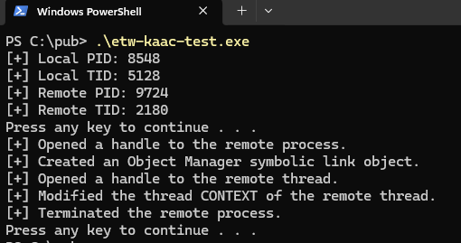
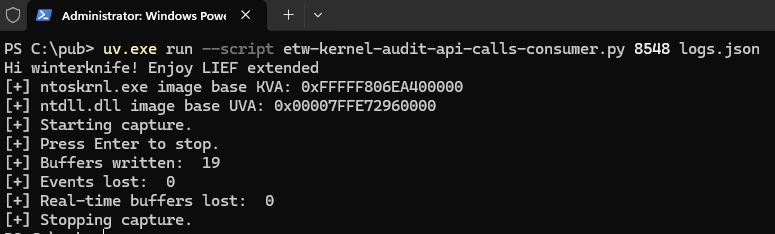

# EVENSTAR - ETWKernelAuditAPICallsConsumer

## Version

- `v1.0`

## Brief

- `Python`-based consumer for the `Microsoft-Windows-Kernel-Audit-API-Calls` kernel `ETW` event provider, powered by `pywintrace`.
- The script is designed to handle all the events from this provider for `API` calls originating in user mode, along with their call stacks.
- The purpose of this script is to monitor the telemetry generated by a target process identified by its `PID`.
- The script does not require the machine to be put into test-signing mode or any `VBS` features to be disabled.

## Usage

- Install `uv`.
- Download `LIEF Extended` pre-built wheel.
- Launch the script like so:
```console
uv.exe run --script etw-kernel-audit-api-calls-consumer.py [PID of process to be monitored] [output filename]
```





Find the sample logs [here](./Misc/logs.json).

## Limitations

- Stack traces are only partially enriched.
- Only 64-bit processes are supported.
- A `WinDbg` `TTD` trace file or a memory dump file from the same run might be required to detect malicious direct system calls.
- Events are buffered in memory and written to disk only during a clean termination of the script, so any unhandled exception or premature termination may result in the loss of the full capture.

## Tested OS Versions

- `Windows 11 25H2 Build 26200 Revision 8655 64-bit`

## References

1. [uv](https://docs.astral.sh/uv/)
2. [Introducing pywintrace: A Python Wrapper for ETW](https://cloud.google.com/blog/topics/threat-intelligence/introducing-pywintrace-python-wrapper-etw)
3. [pywintrace](https://github.com/fireeye/pywintrace)
4. [LIEF Extended](https://extended.lief.re/)
5. [What is LIEF Extended?](https://lief.re/doc/latest/extended/intro.html)
6. [PythonForWindows](https://github.com/hakril/PythonForWindows)
7. [Microsoft-Windows-Kernel-Audit-API-Calls.xml](https://github.com/repnz/etw-providers-docs/blob/master/Manifests-Win10-17134/Microsoft-Windows-Kernel-Audit-API-Calls.xml)
8. [API-To-ETW](https://github.com/jdu2600/API-To-ETW)
9. [Kernel ETW is the best ETW](https://www.elastic.co/security-labs/blog/kernel-etw-best-etw)
10. [Doubling Down: Detecting In-Memory Threats with Kernel ETW Call Stacks](https://www.elastic.co/security-labs/threat-command/doubling-down-etw-callstacks)
11. [CrowdStrike Researchers Investigate the Threat of Patchless AMSI Bypass Attacks](https://www.crowdstrike.com/en-us/blog/crowdstrike-investigates-threat-of-patchless-amsi-bypass-attacks/)
12. [Hunt-Weird-Syscalls](https://github.com/thefLink/Hunt-Weird-Syscalls)
13. [UserTrace007_StackTrace.cs](https://github.com/microsoft/krabsetw/blob/master/examples/ManagedExamples/UserTrace007_StackTrace.cs)
