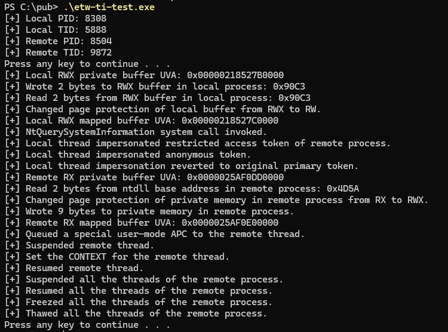
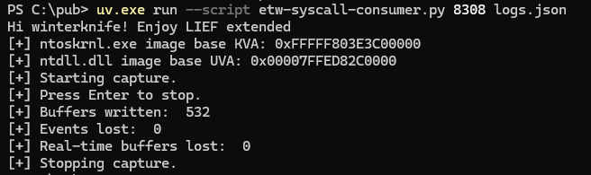

# EVENSTAR - ETWSyscallConsumer

## Version

- `v1.0`

## Brief

- `Python`-based consumer for the `Windows Kernel Trace` `MOF`-based `ETW` event provider, powered by `pywintrace`.
- The script is designed to handle `SysCallEnter` events along with its call stacks.
- The purpose of this script is to monitor all the system calls made by a target process identified by its `PID`.
- The script does not require the machine to be put into test-signing mode or any `VBS` features to be disabled.

## Usage

- Install `uv`.
- Download `LIEF Extended` pre-built wheel.
- Launch the script like so:
```console
uv.exe run --script etw-syscall-consumer.py [PID of process to be monitored] [output filename]
```





Find the sample logs [here](./Misc/logs.json).

## Limitations

- Stack traces are only partially enriched.
- Only 64-bit processes are supported.
- A `WinDbg` `TTD` trace file or a memory dump file from the same run might be required to detect malicious direct system calls.
- Events are buffered in memory and written to disk only during a clean termination of the script, so any unhandled exception or premature termination may result in the loss of the full capture.

## Tested OS Versions

- `Windows 11 25H2 Build 26200 Revision 8655 64-bit`

## References

1. [uv](https://docs.astral.sh/uv/)
2. [Introducing pywintrace: A Python Wrapper for ETW](https://cloud.google.com/blog/topics/threat-intelligence/introducing-pywintrace-python-wrapper-etw)
3. [pywintrace](https://github.com/fireeye/pywintrace)
4. [LIEF Extended](https://extended.lief.re/)
5. [What is LIEF Extended?](https://lief.re/doc/latest/extended/intro.html)
6. [PythonForWindows](https://github.com/hakril/PythonForWindows)
7. [System Syscall Provider](https://learn.microsoft.com/en-us/windows/win32/etw/system-providers#system-syscall-provider)
8. [CONAN: A Practical Real-time APT Detection System with High Accuracy and Efficiency](https://users.cs.northwestern.edu/~ychen/Papers/CONAN_TDSC.pdf)
9. [Improving Detection and Protection Against Anti-Sandbox Techniques](https://excel.fit.vutbr.cz/submissions/2026/053/53.pdf)
10. [War Story: How Antivirus solutions can bring a server down](https://aloiskraus.wordpress.com/2022/12/11/war-story-how-antivirus-solutions-can-bring-a-server-down/)
11. [LEAPS: Detecting Camouflaged Attacks with Statistical Learning Guided by Program Analysis](https://gzs715.github.io/pubs/LEAPS_DSN15.pdf)
12. [PARIS: A Practical, Adaptive Trace-Fetching and Real-Time Malicious Behavior Detection System](https://arxiv.org/pdf/2411.01273v1)
